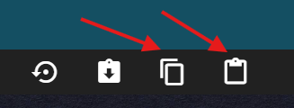
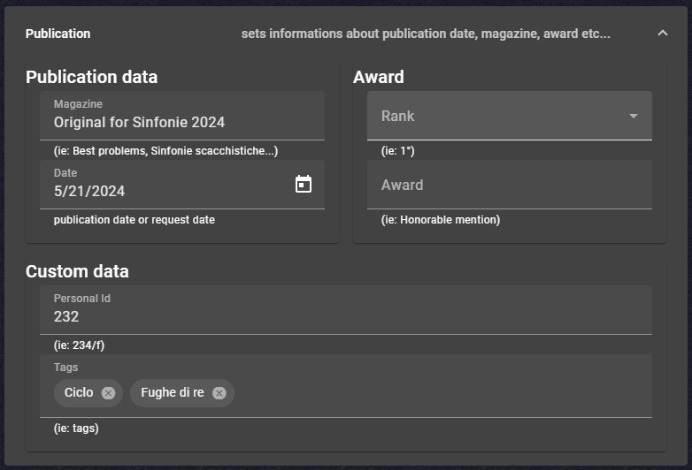

# Release Notes

## Version 0.2.2-dev

Development snapshot after the 0.2.1 release.

### Better Engine Configuration And Richer Solver Feedback

This snapshot focuses on the solve workflow, bringing clearer configuration options and more complete runtime feedback from both web and desktop integrations.

**What's New:**

- ⚙️ **Dedicated engine configuration dialog** - Engine settings are now managed through a dedicated dialog in the editor flow, with cleaner internal engine handling
- 🧩 **New engine option: Popeye (ASM)** - Added support for selecting and using the Popeye ASM engine profile
- 📈 **Richer solver summary** - Solver output now includes elapsed time and attempts, with updated options based on refutations count
- 🔁 **Improved reactive state in data manager** - Current item index, selected file, and counters are now signal-driven for more consistent UI updates
- 🖥️ **Desktop bridge payload improvements** - Tauri and Rust solver messaging now carries richer solution and threat information
- 🔐 **More robust account/token fallback** - Authentication token acquisition now handles missing-account scenarios more reliably

**What changes for you:**

- Engine setup is clearer before launching analysis
- Solver progress and results provide better diagnostic context
- Desktop solve data is more complete when rendering complex outcomes

**Compatibility:**

- Existing problem/database files remain compatible

## Version 0.2.1

### Build Hardening, CLI Improvements, And Docs Publication

This release focused on reliability and distribution: CI workflows were strengthened, the Rust solver CLI was expanded, and project documentation publishing was automated.

**What's New:**

- 🏗️ **Tag release workflow overhaul** - Release pipeline now publishes multi-platform Tauri artifacts (Linux, Windows, macOS) as GitHub Release assets
- 📚 **Automatic docs publishing** - Added documentation publishing workflow to GitHub Pages on pushes to `master`
- 🦀 **Expanded Rust solver CLI** - Improved CLI output (including JSON mode, tries, threats, refutations) and better FEN/Popeye parsing
- ♟️ **Solver engine hardening** - Improvements in alpha-beta pruning, transposition-table behavior, and winning-line extraction
- 📦 **Monorepo package-manager alignment** - `popeye-js` migrated from Yarn to pnpm
- 🧭 **Published docs structure** - Introduced project docs pages for solver CLI and release procedures
- 🔧 **Build fixes** - Restored `baseUrl` and pinned `concat@3.0.0` to resolve Angular build issues introduced in 0.2.0

**What changes for you:**

- Releases are more consistent across desktop targets
- Solver CLI output is richer and easier to integrate in automation
- Build and docs pipelines are more stable and predictable

**Compatibility:**

- Existing problem/database files remain compatible

## Version 0.2.0

### New Solver Foundations And Better Analysis Workflow

This release introduces the new Rust solver workspace and connects more of that solving pipeline to the application flow.

**What's New:**

- ♟️ **New solver core** - Added a Rust workspace with dedicated crates for chess rules, problem parsing, solving, and CLI tooling
- 📖 **Richer solution output** - Winning lines now support SAN-style formatting and improved textual reports
- 🚀 **Better search performance** - Added alpha-beta pruning, transposition-table caching, TTL handling, and iterative deepening in the solver stack
- 🎛️ **Improved GUI solving workflow** - The editor now supports engine selection, streaming updates while solving, live solution counts, and max-solution reporting
- 🖥️ **Desktop integration updates** - Tauri integration and CI packaging were improved for cross-platform desktop builds
- ✅ **Stronger validation** - Added end-to-end integration tests for chess positions and the streaming pipeline

**What changes for you:**

- You get earlier feedback while solutions are being generated
- Solution output is clearer and closer to standard chess notation
- The project has a stronger foundation for future solver and desktop releases

**Compatibility:**

- Existing problem files remain compatible

## Version 0.1.1

### Chessboard Reactivity And Stability Fixes

This maintenance release resolved rendering regressions and stabilized signal-based update flows.

**What's New:**

- 🔧 **Chessboard rendering fix** - Piece changes (add, remove, move) now trigger UI refresh correctly
- ⚙️ **Signal reactivity improvements** - Updated state propagation for `Problem` changes to improve consistency
- 🧹 **Refactoring for maintainability** - Cleanup of change-detection paths in the editor workflow

**What changes for you:**

- Board updates are reliably visible after edits
- Editing interactions feel more predictable
- Fewer visual inconsistencies while composing problems

**Compatibility:**

- Existing problem/database files remain compatible

## Version 0.1.0

### Performance and Stability Improvements

This release introduces significant improvements in responsiveness and interface fluidity.

**What's New:**

- ⚡ **Faster and more responsive interface** - The application responds instantly to your commands
- 🎯 **Immediate rendering** - No visible delays when modifying positions or stipulations
- 📊 **Improved stability** - Eliminated display update issues

**What changes for you:**

- The editor responds faster when you move pieces on the board
- The toolbar updates immediately when you change edit modes
- Database search is smoother and more responsive
- All changes to problems are displayed instantly without delays

**Compatibility:**

- Existing problem/database files remain compatible

## Version 0.0.13

### Desktop Foundations And Editor Usability

This release expanded platform support and introduced key editor usability enhancements.

**What's New:**

- Improved Popeye move parser as foundation for solution navigation with live board updates
- Added Tauri support with platform bridge integration and desktop build configuration
- Added Terms and Conditions page
- Improved small-screen layout behavior
- Added board coordinates
- Added copy/paste support for position editing, including toolbar buttons

**What changes for you:**

- You can run desktop builds on supported platforms
- Position editing is faster with dedicated copy/paste controls
- Mobile and small-screen usage is more practical

**Compatibility:**

- Existing problem/database files remain compatible
  
## Version 0.0.12

### Publication Metadata Support

This release introduced publication-related metadata fields in the editor workflow.

**What's New:**

- Added controls for Publications, Awards, Tags, and related metadata

**What changes for you:**

- You can store richer editorial and publication details directly in the problem record

**Compatibility:**

- Existing problem/database files remain compatible

## Version 0.0.11

### Layout Modernization And Import Fixes

This release focused on interface structure and SP2 import reliability.

**What's New:**

- Introduced a new grid layout for page composition
- Fixed SP2 import line-break handling

**What changes for you:**

- Screen layout is cleaner and more consistent
- SP2 imports are more robust in affected cases

**Compatibility:**

- Existing problem/database files remain compatible

## Version 0.0.10

### iOS Figurine Fix

This maintenance release corrected figurine rendering on iOS devices.

**What's New:**

- Fixed figurine display issues on iOS

**What changes for you:**

- Piece symbols render correctly on iPhone and iPad browsers

**Compatibility:**

- Existing problem/database files remain compatible

## Version 0.0.9

### Save, Layout, And File-Handling Stabilization

This release bundled a broad set of usability and reliability fixes across navigation, layout, and file operations.

**What's New:**

- Fixed local file save flow ([#129](https://github.com/dardino/scacchi-painter/issues/129))
- Kept `Configuration` menu item always visible
- Aligned `Save` button in the Save As page
- Improved toolbar stickiness and landing-page layout
- Fixed `Recent files` panel sizing and crash scenarios
- Improved engine toolbar scrolling on small devices
- Added SP2 open/save support with initial compatibility coverage ([#37](https://github.com/dardino/scacchi-painter/issues/37))

**What changes for you:**

- Save and navigation workflows are more stable
- Small-screen usability is improved
- SP2 workflows are supported with broader coverage than previous versions

**Compatibility:**

- Existing problem/database files remain compatible

## Version 0.0.8

### First Release Notes Publication

This release introduced the release-notes page itself.

**What's New:**

- Added project release-notes documentation page

**What changes for you:**

- Product updates are now documented in a centralized changelog narrative

**Compatibility:**

- Existing problem/database files remain compatible

## Version 0.0.7

### Early Editing Metadata Improvements

This release improved editor context and introduced basic author metadata management.

**What's New:**

- Added a FEN label under the chessboard in the editor page
- Added a minimal Author management flow

**What changes for you:**

- Position context is easier to read while editing
- You can store basic author information in the project workflow

**Compatibility:**

- Existing problem/database files remain compatible

## Version 0.0.6

### Twin Handling Fixes

This maintenance release corrected twin management behavior.

**What's New:**

- Fixed twins handling ([#151](https://github.com/dardino/scacchi-painter/issues/151))

**What changes for you:**

- Twin-related editing scenarios behave correctly in affected cases

**Compatibility:**

- Existing problem/database files remain compatible

## Version 0.0.5

### Foundational Editor And Database Features

This release laid important foundations for editing, database management, and user personalization.

**What's New:**

- Added WYSIWYG editor support for HTML content ([#149](https://github.com/dardino/scacchi-painter/issues/149))
- Implemented `Try this move` function
- Added menu command for problem listing ([#105](https://github.com/dardino/scacchi-painter/issues/105))
- Implemented twin editor ([#39](https://github.com/dardino/scacchi-painter/issues/39))
- Added localStorage preferences for sidebar size and solution font size
- Added controls to adjust plain-text solution font size
- Added resizable chessboard area in edit view
- Added database `Add`/`Remove` operations ([#119](https://github.com/dardino/scacchi-painter/issues/119))
- Added commands to insert problems into current database ([#106](https://github.com/dardino/scacchi-painter/issues/106))
- Added problem selection from database page ([#103](https://github.com/dardino/scacchi-painter/issues/103))

**What changes for you:**

- Editing and experimentation workflows are more complete
- Database operations are integrated into the UI flow
- Personalization settings persist between sessions

**Compatibility:**

- Existing problem/database files remain compatible
