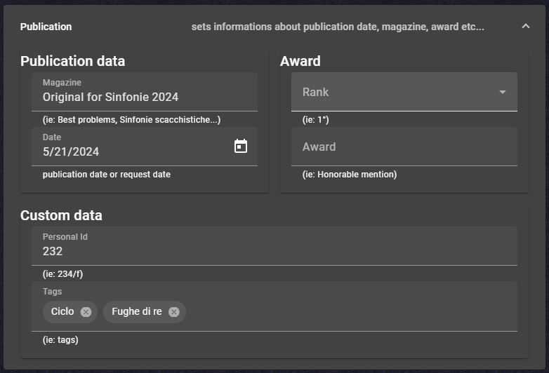

# Release Notes

## Version 0.0.13

- Added functionality to copy and paste position in the editor page:
  - se il cursore è posizionato in un elemento editabile (input o text editor) il comportamento è standard
  - se il cursore non è posizionato in alcun elemento allora gli eventi di copia e incolla agiscono sulla posizione corrente
  - aggiunti due pulsanti alla toolbar di modifica per copia posizione e incolla:
    
  
## Version 0.0.12

- Added controls to store information about Publications, Awards, Tags and so more:
  

## Version 0.0.11

- New Grid Layout to place elements in page
- Fixing imports from SP2: line-break

## Version 0.0.10

- Fix figurine in iOS

## Version 0.0.9

- Fixed Save to local file: ([#129](https://github.com/dardino/scacchi-painter/issues/129))
- Menu item `Configuration` now is always visible
- The button `Save` in `save-as` page is now aligned to the field
- Main toolbar is positioned as stiky
- Better layout management for landing page
- "Recent files" section is now as tall as its container
- Clicking in one of the recent files now does not crash if any error occurs
- Engine toolbar now scrolls in small devices
Added the ability to open a sp2 file and save it, However, since not all possible cases have been tested, it is a good idea to make a copy of the file before opening it ([#37](https://github.com/dardino/scacchi-painter/issues/37))

## Version 0.0.8

- Added this relase-note page

## Version 0.0.7

- Added a FEN label under the chessboard in the editor page
- Added a "mini" Author management with minimal functionality

## Version 0.0.6

- Fixed twins [#151](https://github.com/dardino/scacchi-painter/issues/151)

## Version 0.0.5

- Added a WYSIWYG editor to edit as HTML ([#149](https://github.com/username/repo/issues/149))
- Implemented "Try this move" function
- Added a new menu command: **list of problems** ([#105](https://github.com/username/repo/issues/105))
- Implemented twin editor ([#39](https://github.com/username/repo/issues/39))
- Implemented a functionality to memoize these user prefereces in localStorage:
  - Memoized size of the sidebar
  - Adjustable font size for the solution panel
- Added the possibility to increase/decrease font size in the solution panel only for plain text mode
- Added the possibility to change the size of the chessboard in edit page dragging the split vertical bar
- Added functionality to "Add" and "Remove" problems from the database ([#119](https://github.com/username/repo/issues/119))
- Added commands to add a problem into the current database ([#106](https://github.com/username/repo/issues/106))
- Implemented problem selection from the database page ([#103](https://github.com/username/repo/issues/103))
